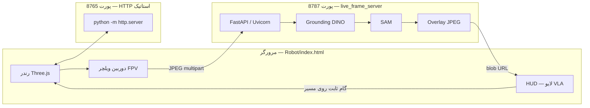

# Robot-and-VLM

**دموی یکپارچهٔ ویلچر سه‌بعدی + پل زندهٔ ادراک (VLA)**  
صفحهٔ وب با **Three.js** مسیر ویلچر را در یک خانهٔ چندفضایی محاسبه و نمایش می‌دهد؛ با فعال‌سازی حالت لایو، فریم‌های **دوربین نصب‌شده روی ویلچر** به سرور **FastAPI** فرستاده می‌شوند، **Grounding DINO** و **SAM** روی GPU اجرا می‌شوند، تصویر با **overlay** (جعبه و ماسک) برمی‌گردد و در همان چرخه، ویلچر به‌صورت **گام‌های ثابت** روی مسیر زرد حرکت می‌کند.

این ریپو **مخصوص همین سناریوی تست/ادغام** است: یک درخت پروژه، یک اسکریپت اجرا، بدون نیاز به دو کلون جدا برای Robot و VLA.

---

## فهرست

1. [معماری و جریان داده](#معماری-و-جریان-داده)
2. [ساختار ریپو](#ساختار-ریپو)
3. [پیش‌نیازها](#پیش‌نیازها)
4. [نصب](#نصب)
5. [دانلود مدل‌ها](#دانلود-مدل‌ها)
6. [اجرای پشته](#اجرای-پشته)
7. [پورت‌ها و اینکه «کجا را در مرورگر باز کنی»](#پورت‌ها-و-اینکه-کجا-را-در-مرورگر-باز-کنی)
8. [API سرور لایو](#api-سرور-لایو)
9. [پیکربندی](#پیکربندی)
10. [سمت فرانت‌اند (Robot)](#سمت-فرانت‌اند-robot)
11. [کارایی و منابع سخت‌افزاری](#کارایی-و-منابع-سخت‌افزاری)
12. [عیب‌یابی](#عیب‌یابی)
13. [Git و فایل‌های حجیم](#git-و-فایل‌های-حجیم)

---

## معماری و جریان داده



**خلاصه:** مرورگر فقط **HTML/JS/دارایی‌ها** را از `8765` می‌گیرد. پردازش سنگین فقط روی **`8787`** است. این دو را عمداً جدا کرده‌ایم تا CORS و کش مرورگر قابل پیش‌بینی باشد و API قابل تست مستقل بماند.

---

## ساختار ریپو

| مسیر | نقش |
|------|-----|
| **`Robot/`** | اپ وب: `index.html`, `three.min.js`, لودرها، `assets/models/` (OBJ/MTL/تکسچر) |
| **`VLA/`** | پایتون: دیتکت/سگمنت، پایپلاین فاز۱، **`scripts/live_frame_server.py`**, **`config/live_robot_bridge.yaml`** |
| **`start_stack.sh`** | از **ریشهٔ همین ریپو**: سرور استاتیک `Robot` + اجرای API از داخل `VLA/` |
| **`.gitignore`** | حذف `venv`، **`VLA/models/`**، وزن‌ها، خروجی‌های حجیم، لاگ |

ریشهٔ کاری برای اسکریپت‌های VLA همیشه **پوشهٔ `VLA/`** است (مثل `os.chdir` در سرور لایو).

---

## پیش‌نیازها

| مورد | توضیح |
|------|--------|
| **OS** | لینوکس یا macOS برای اسکریپت bash؛ ویندوز با WSL یا اجرای دستی معادل |
| **Python** | 3.10 یا بالاتر (توصیه: همان نسخه‌ای که با PyTorch سازگار است) |
| **GPU** | **CUDA** برای اجرای واقعی DINO + SAM (در کانفیگ پیش‌فرض `device: cuda`) |
| **PyTorch** | بعد از `pip install -r requirements.txt` اگر درایور/نسخهٔ CUDA خطا داد، طبق [PyTorch](https://pytorch.org/get-started/locally/) بستهٔ `torch` مناسب نصب کنید |
| **RAM / VRAM** | SAM ViT-H و DINO کوچک معمولاً چند گیگابایت VRAM می‌خواهند؛ در صورت کمبود، نوع SAM یا `max_infer_side` را کاهش دهید |

---

## نصب

```bash
git clone https://github.com/rezabahadori76/Robot-and-VLM.git
cd Robot-and-VLM

cd VLA
python3 -m venv .venv
source .venv/bin/activate          # Windows: .venv\Scripts\activate
pip install --upgrade pip
pip install -r requirements.txt
cd ..
```

در صورت نیاز به **CUDA مشخص**، بعد از نصب پایه، `torch`/`torchvision` را مطابق راهنمای رسمی دوباره نصب کنید.

---

## دانلود مدل‌ها

وزن‌ها داخل Git نیستند؛ پس از کلون باید پوشهٔ `VLA/models/` پر شود:

```bash
cd VLA
source .venv/bin/activate
python scripts/download_models.py --root models
```

مسیرهای مورد انتظار با **`config/live_robot_bridge.yaml`** هم‌خوان است (مثلاً `models/grounding_dino_tiny`, چک‌پوینت SAM). اگر اسکریپت خطا داد، `requests` و دسترسی به اینترنت/Hugging Face را بررسی کنید.

---

## اجرای پشته

از **ریشهٔ ریپو** (همان جایی که `start_stack.sh` است):

```bash
chmod +x start_stack.sh
./start_stack.sh
```

این کار:

1. **`python3 -m http.server`** را روی **`ROBOT_PORT`** (پیش‌فرض **8765**) با روت **`Robot/`** بالا می‌آورد.
2. **`VLA/scripts/live_frame_server.py`** را روی **`VLA_PORT`** (پیش‌فرض **8787**) اجرا می‌کند؛ در صورت وجود، از **`VLA/.venv/bin/python3`** استفاده می‌کند.

**اجرای دستی (بدون اسکریپت):**

```bash
# ترمینال 1 — از ریشهٔ ریپو
cd Robot && python3 -m http.server 8765 --bind 0.0.0.0

# ترمینال 2 — از پوشهٔ VLA
cd VLA && source .venv/bin/activate
python scripts/live_frame_server.py --host 0.0.0.0 --port 8787
```

اولین بار API ممکن است **چند دقیقه** طول بکشد تا مدل‌ها روی GPU لود شوند؛ تا وقتی `GET /health` مقدار `ok: true` بدهد صبر کنید.

---

## پورت‌ها و اینکه «کجا را در مرورگر باز کنی»

| آدرس | نقش | در مرورگر؟ |
|------|-----|-------------|
| **`http://127.0.0.1:8765/`** | رابط دمو، صحنهٔ ۳بعدی، HUD | **بله — اینجا را باز کن** |
| **`http://127.0.0.1:8787/`** | سرور API (راهنمای HTML یا JSON) | خیر برای دمو؛ فقط تست یا ابزار |
| **`http://127.0.0.1:8787/health`** | وضعیت مدل‌ها | برای DevOps / دیباگ |

اگر تب مرورگر را روی **8787** گذاشته باشی و انتظار خانهٔ سه‌بعدی داشته باشی، **اشتباه است** — صحنه همیشه روی **8765** است. در HUD همان دمو، فیلد **«VLA API»** باید آدرس پایهٔ API باشد، مثلاً `http://127.0.0.1:8787` (بدون اسلش اضافه در انتها برای `fetch` معمولی).

---

## API سرور لایو

پایه: `http://<host>:8787` (در لوکال همان `127.0.0.1`).

| متد | مسیر | توضیح |
|-----|------|--------|
| `GET` | `/` | اگر `Accept: text/html` باشد، صفحهٔ راهنما؛ با `?format=json` یا هدر JSON، متادیتای سرویس |
| `GET` | `/health` | `{ ok, detection, segmentation }` — بعد از لود مدل‌ها |
| `POST` | `/process_frame` | بدنهٔ **`multipart/form-data`** با یک فیلد فایل تصویر (JPEG)؛ پاسخ **`image/jpeg`** با overlay |

**نمونهٔ `curl`:**

```bash
curl -sS -o /tmp/out.jpg -w "%{http_code}\n" \
  -X POST -F "frame=@sample.jpg" \
  http://127.0.0.1:8787/process_frame
```

CORS برای توسعه روی `*` باز است تا فرانت روی پورت دیگر بتواند به API بزند.

---

## پیکربندی

### فایل YAML اصلی

**`VLA/config/live_robot_bridge.yaml`**

- **`detection`**: مدل DINO، آستانه‌ها، پرامپت کلاس‌ها (به انگلیسی با نقطه بین برچسب‌ها).
- **`segmentation`**: نوع SAM و مسیر چک‌پوینت زیر `VLA/models/`.
- **`visualization`**: ماسک/باکس، ضخامت خط، **`show_semantic_label`** (در لایو معمولاً `false` چون VLM اجرا نمی‌شود).
- **`live_bridge`**: **`max_infer_side`** (کوچک‌تر = سریع‌تر روی GPU)، **`jpeg_quality`**.

### متغیرهای محیطی (رایج)

| متغیر | نقش |
|--------|-----|
| `VLA_NUM_THREADS` | سقف ترد CPU برای PyTorch/BLAS/OpenCV (پیش‌فرض در `start_stack`: `nproc`) |
| `VLA_MAX_INFER_SIDE` | بازنویسی لحظه‌ای بزرگ‌ترین ضلع ریسایز ورودی |
| `VLA_JPEG_QUALITY` | کیفیت JPEG خروجی |
| `VLA_LOG_LEVEL` | سطح لاگ Uvicorn (مثلاً `warning`) |
| `ROBOT_PUBLIC_URL` | لینک نمایش‌داده‌شده در صفحهٔ روت API برای رفتن به دمو (پیش‌فرض `http://127.0.0.1:8765`) |
| `ROBOT_PORT` / `VLA_PORT` | فقط در **`start_stack.sh`** برای پورت‌ها |
| `ROBOT_DIR` / `VLA_DIR` | اگر ساختار پوشه‌ها را عوض کردی |

سرور لایو از **`--config`** هم پشتیبانی می‌کند (پیش‌فرض همان `live_robot_bridge.yaml`).

---

## سمت فرانت‌اند (Robot)

- فایل اصلی: **`Robot/index.html`**.
- در HUD گزینهٔ **VLA live** و فیلد **VLA API** را فعال کن؛ آدرس پایه باید به همان ماشینی که API روی آن است اشاره کند (روی سرور ریموت، IP یا دامنهٔ آن سرور).
- اندازهٔ گام حرکت ویلچر پس از هر پاسخ موفق API با ثابت **`VLA_PATH_STEP_METERS`** در همان فایل تنظیم می‌شود (متر).
- مسیر زرد، سنسور دوربین، و در صورت فعال بودن منطق، **replan** پویا در همان اسکریپت پیاده شده‌اند.

---

## کارایی و منابع سخت‌افزاری

- **`start_stack.sh`** متغیرهایی مثل `OMP_DYNAMIC=false` و `MKL_DYNAMIC=false` و `VLA_NUM_THREADS` را برای استفادهٔ پایدار از هسته‌ها تنظیم می‌کند.
- در **`live_frame_server`** برای CUDA معمولاً **TF32**، **`cudnn.benchmark`**, و دقت ضرب ماتریس روی «high» فعال است؛ جزئیات در همان سورس.
- **چند worker برای Uvicorn** برای این سناریو توصیه نمی‌شود: هر worker مدل را جداگانه لود می‌کند و VRAM را چند برابر می‌کند. گلوگاه اصلی معمولاً **یک مسیر استنتاج GPU** است.
- برای سرعت بیشتر: **`max_infer_side`** را در YAML کم کن یا با env تنظیم کن؛ کیفیت بصری/segmentation ممکن است کم شود.

---

## عیب‌یابی

| علامت | احتمال | کار |
|--------|--------|-----|
| صفحهٔ 8787 «خالی» یا غیرمنتظره | انتظار اشتباه | **دمو را از 8765 باز کن** |
| `health` خطا یا timeout | مدل‌ها لود نشده‌اند | لاگ ترمینال API، مسیر `models/`، CUDA |
| خطای CUDA / driver | ناسازگاری `torch` و درایور | نصب مجدد `torch` با نسخهٔ CUDA درست |
| CORS در محیط غیرلوکال | دامنهٔ متفاوت | در صورت نیاز منشأ را در `live_frame_server` محدود کن (فعلاً `*`) |
| کندی شدید | VRAM یا ورودی بزرگ | کاهش `max_infer_side`، سبک‌تر کردن SAM در YAML |

---

## Git و فایل‌های حجیم

- **`VLA/models/`**، **`VLA/data/`**، **`VLA/outputs/`** و وزن‌های رایج (`.pth`, `.safetensors`, …) در **`.gitignore`** هستند.
- پوشهٔ **`VLA/third_party/`** ممکن است حجیم باشد؛ برای RTABMap فقط **`build/`** و **`install/`** نادیده گرفته می‌شوند.
- ویدئو و خروجی‌های پایپلاین فاز۱ در ریشهٔ `.gitignore` برای سبک ماندن ریپو لحاظ شده‌اند.

---

## مجوز و اعتبار

- مدل‌ها و کتابخانه‌های شخص ثالث تحت مجوزهای خودشان هستند.
- دارایی‌های سه‌بعدی داخل **`Robot/assets/`** را قبل از انتشار محصول تجاری با مجوز هر منبع بررسی کن.

---

**خلاصه یک خطی:** کلون → `venv` در `VLA` → `pip install` → `download_models` → از ریشه `./start_stack.sh` → مرورگر **`http://127.0.0.1:8765`** → در HUD آدرس API **`http://127.0.0.1:8787`**.
