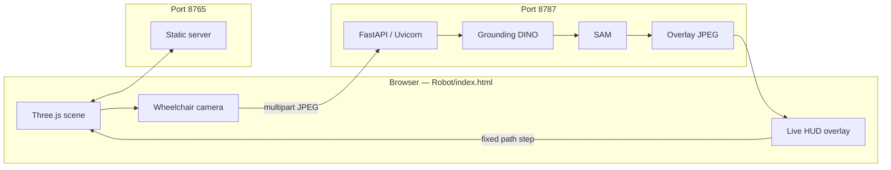

# Robot-and-VLM

Integrated repository for a **wheelchair 3D simulator (Three.js)** and a **live VLA perception bridge**.

The browser app renders a multi-room home scene and drives the wheelchair along a planned route. In live mode, each wheelchair-camera frame is sent to a FastAPI endpoint that runs **Grounding DINO + SAM**, returns an overlay JPEG, and advances the wheelchair in fixed path steps.

---

## Table of Contents

1. [Architecture](#architecture)
2. [Repository Layout](#repository-layout)
3. [Requirements](#requirements)
4. [Setup](#setup)
5. [Model Download](#model-download)
6. [Run the Full Stack](#run-the-full-stack)
7. [Ports and URLs](#ports-and-urls)
8. [Live API](#live-api)
9. [Configuration](#configuration)
10. [Performance Notes](#performance-notes)
11. [Troubleshooting](#troubleshooting)

---

## Architecture



---

## Repository Layout

| Path | Purpose |
|------|---------|
| `Robot/` | Web app (`index.html`, Three.js assets, path logic, UI controls) |
| `VLA/` | Python inference modules, `scripts/live_frame_server.py`, configs |
| `start_stack.sh` | Starts Robot static server + VLA API together |
| `.gitignore` | Excludes local models, venvs, outputs, and heavy artifacts |

---

## Requirements

- Python 3.10+
- GPU recommended for real-time DINO + SAM (`device: cuda` in default config)
- Compatible PyTorch build for your CUDA/driver combination

---

## Setup

```bash
git clone https://github.com/rezabahadori76/Robot-and-VLM.git
cd Robot-and-VLM

cd VLA
python3 -m venv .venv
source .venv/bin/activate
pip install --upgrade pip
pip install -r requirements.txt
cd ..
```

---

## Model Download

```bash
cd VLA
source .venv/bin/activate
python scripts/download_models.py --root models
```

Model weights are intentionally not committed to Git.

---

## Run the Full Stack

From repository root:

```bash
chmod +x start_stack.sh
./start_stack.sh
```

What it does:

1. Starts Robot static server on `ROBOT_PORT` (default `8765`) via `Robot/serve_robot.py`
2. Starts VLA API on `VLA_PORT` (default `8787`) via `VLA/scripts/live_frame_server.py`
3. Kills previous listeners on these ports before restart

---

## Ports and URLs

- **UI (open this in browser):** `http://127.0.0.1:8765/`
- **Inference API:** `http://127.0.0.1:8787/`
- **Health endpoint:** `http://127.0.0.1:8787/health`

Important: port `8787` is API-only, not the 3D simulator page.

---

## Live API

### `GET /`
Returns JSON metadata (or redirects browser clients to UI unless disabled).

### `GET /health`
Returns runtime status of detection/segmentation modules.

### `POST /process_frame`
Input: multipart form with `frame` (JPEG)  
Output: JPEG with segmentation/detection overlay.

Example:

```bash
curl -sS -o /tmp/out.jpg -w "%{http_code}\n" \
  -X POST -F "frame=@sample.jpg" \
  http://127.0.0.1:8787/process_frame
```

---

## Configuration

Primary runtime config: `VLA/config/live_robot_bridge.yaml`

Key sections:

- `detection`: DINO model, thresholds, prompt
- `segmentation`: SAM model/checkpoint
- `visualization`: masks/boxes/label controls
- `live_bridge`: `max_infer_side`, `jpeg_quality`

Useful environment variables:

- `VLA_NUM_THREADS`
- `VLA_MAX_INFER_SIDE`
- `VLA_JPEG_QUALITY`
- `VLA_LOG_LEVEL`
- `ROBOT_PORT`, `VLA_PORT`
- `ROBOT_PUBLIC_URL`

---

## Performance Notes

- Keep API as a single process for GPU memory stability.
- Lower `max_infer_side` to improve throughput.
- Startup can be slow on first run while loading models.

---

## Troubleshooting

- If browser shows nothing useful on `8787`, open `8765` instead.
- If `/health` fails, check model files under `VLA/models`.
- If CUDA errors appear, reinstall a compatible PyTorch build.
- If updates seem stale in browser, restart stack (the Robot server is set for no-cache headers).

